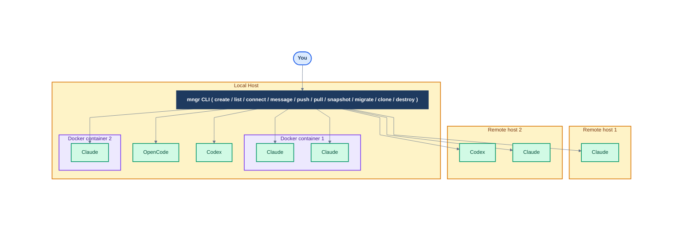
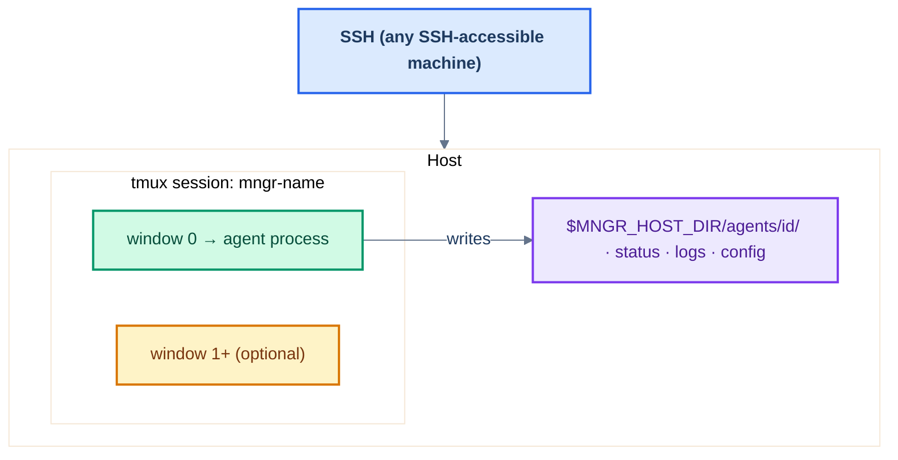

# mngr: run any coding agent in parallel, anywhere

[](https://github.com/imbue-ai/mngr)
[](https://pypi.org/project/imbue-mngr/)
[](https://pypi.org/project/imbue-mngr/)
[](./LICENSE)
[](https://github.com/imbue-ai/mngr/issues)

`mngr` is a Unix-style tool for managing coding agents.

Seamlessly scale from a single local Claude to 100s of agents across remote hosts, containers, and sandboxes.
List all your agents, see which are blocked, and instantly connect to any of them to chat or debug.
Compose your own powerful workflows on top of agents without being locked in to any specific provider or interface.

*Built on SSH, git, and tmux. Extensible via [plugins](libs/mngr/docs/concepts/plugins.md) . No managed service required.*

---

**installation:**
```bash
curl -fsSL https://raw.githubusercontent.com/imbue-ai/mngr/main/scripts/install.sh | bash
```

## Overview

`mngr` makes it easy to create and use *any AI agent* (ex: Claude Code, Codex), *anywhere* (locally, in Docker, on Modal, etc.).

Think of `mngr` as "git for agents": just like git allows you to `commit`/`push`/`pull`/`fork`/`clone` *versions of code*, `mngr` allows you to `create`/`destroy`/`list`/`clone`/`message` *agents*.



## Why mngr

Most agent tooling is a managed cloud: opaque infrastructure, per-seat pricing, hard to script. 

`mngr` takes the opposite approach.
Agents run on compute you control, that you access via SSH, and that shuts down when idle. 
It's built on primitives you already know (SSH, git, tmux, docker), and 

`mngr` is designed to be:

- **Simple** — one command launches an agent locally or on Modal; sensible defaults throughout
- **Fast** — agents start in under 2 seconds
- **Cost-transparent** — free CLI; agents auto-shutdown when idle; pay only for inference and compute
- **Secure** — SSH key isolation, network allowlists, full container control
- **Composable** — shared hosts, snapshot and fork agent state, direct exec, push/pull/pair
- **Observable** — transcripts, direct SSH, programmatic messaging
- **Easy to learn** — `mngr ask` answers usage questions without leaving the terminal

---

**mngr is *very* simple to use:**

```bash
mngr create           # launch claude locally (defaults: agent=claude, provider=local, project=current dir)
mngr create @.modal          # launch claude on Modal (new host with auto-generated name)
mngr create my-task          # launch claude with a name
mngr create my-task codex    # launch codex instead of claude
mngr create -- --model opus  # pass any arguments through to the underlying agent

# send an initial message so you don't have to wait around:
mngr create --no-connect --message "Speed up one of my tests and make a PR on github"

# or, be super explicit about all of the arguments:
mngr create my-task@.modal --type claude

# tons more arguments for anything you could want! Learn more via --help
mngr create --help

# or see the other commands--list, destroy, message, connect, push, pull, clone, and more!
mngr --help
```

**mngr is fast:**
```bash
> time mngr create local-hello  --message "Just say hello" --no-connect
Done.

real    0m1.472s
user    0m1.181s
sys     0m0.227s

> time mngr list
NAME           STATE       HOST        PROVIDER    HOST STATE  PROJECT
local-hello    RUNNING     localhost   local       RUNNING     mngr

real    0m1.773s
user    0m0.955s
sys     0m0.166s
```

**mngr is free, *and* the cheapest way to run remote agents (they shut down when idle):**

```bash
mngr create @.modal --no-connect --message "just say 'hello'" --idle-timeout 60 -- --model sonnet
# costs $0.0387443 for inference (using sonnet)
# costs $0.0013188 for compute because it shuts down 60 seconds after the agent completes
```

**mngr takes security and privacy seriously:**

```bash
# by default, cannot be accessed by anyone except your modal account (uses a local unique SSH key)
mngr create example-task@.modal

# you (or your agent) can do whatever bad ideas you want in that container without fear
mngr exec example-task "rm -rf /"

# you can block all outgoing internet access
mngr create @.modal -b offline

# or restrict outgoing traffic to certain IPs
mngr create @.modal -b cidr-allowlist=203.0.113.0/24
```

**mngr is powerful and composable:**

```bash
# start multiple agents on the same host to save money and share data
mngr create agent-1@shared-host.modal --new-host
mngr create agent-2@shared-host

# run commands directly on an agent's host
mngr exec agent-1 "git log --oneline -5"

# never lose any work: snapshot and fork the entire agent states
mngr create doomed-agent@.modal
SNAPSHOT=$(mngr snapshot create doomed-agent --format "{id}")
mngr message doomed-agent "try running 'rm -rf /' and see what happens"
mngr create new-agent --snapshot $SNAPSHOT
```

**mngr makes it easy to see what your agents are doing:**

```bash
# programmatically send messages to your agents and see their chat histories
mngr message agent-1 "Tell me a joke"
mngr transcript agent-1
```

<!--
# [future] schedule agents to run periodically
mngr schedule --template my-daily-hook "look at any flaky tests over the past day and try to fix one of them" --cron "0 * * * *"
-->

**mngr makes it easy to work with remote agents:**

```bash
mngr connect my-agent       # directly connect to remote agents via SSH for debugging
mngr pull my-agent          # pull changes from an agent to your local machine
mngr push my-agent          # push your changes to an agent
mngr pair my-agent          # or sync changes continuously!
```

**mngr is easy to learn:**

```text
> mngr ask "How do I create a container on modal with custom packages installed by default?"

Simply run:
    mngr create @.modal -b "--file path/to/Dockerfile"
```

<!--
If you don't have a Dockerfile for your project, run:
    mngr bootstrap   # [future]

From the repo where you would like a Dockerfile created.
-->

## Installation

**Quick install:**
```bash
curl -fsSL https://raw.githubusercontent.com/imbue-ai/mngr/main/scripts/install.sh | bash
```
This installs [uv](https://docs.astral.sh/uv/) and mngr (`uv tool install imbue-mngr`), then interactively prompts about system dependencies and optional extras. You can [review the script](scripts/install.sh) before running it.

**Manual install** (requires [uv](https://docs.astral.sh/uv/) and core system deps: `ssh`, `git`, `tmux`, `jq`; optional: `rsync`, `unison`, `claude`):
```bash
uv tool install imbue-mngr

# or run without installing
uvx --from imbue-mngr mngr
```

**Upgrade:**
```bash
uv tool upgrade imbue-mngr
```

**For development:**
```bash
git clone git@github.com:imbue-ai/mngr.git && cd mngr && uv sync --all-packages && uv tool install -e libs/mngr
```

## Shell completion

`mngr` supports tab completion for commands, options, and agent names in bash and zsh.
Shell completion is configured automatically by the install script (`scripts/install.sh`).

To set up manually, generate the completion script and append it to your shell rc file:

**Zsh** (run once):
```bash
uv tool run --from imbue-mngr python3 -m imbue.mngr.cli.complete --script zsh >> ~/.zshrc
```

**Bash** (run once):
```bash
uv tool run --from imbue-mngr python3 -m imbue.mngr.cli.complete --script bash >> ~/.bashrc
```

Note: `mngr` must be installed on your PATH for completion to work (not invoked via `uv run`).

## Commands

```bash
# without installing:
uvx --from imbue-mngr mngr <command> [options]

# if installed:
mngr <command> [options]
```

### For managing agents:

- **[`create`](libs/mngr/docs/commands/primary/create.md)**: Create and run an agent in a host
- [`destroy`](libs/mngr/docs/commands/primary/destroy.md): Stop an agent (and clean up any associated resources)
- [`connect`](libs/mngr/docs/commands/primary/connect.md): Attach to an agent
<!-- - [`open`](libs/mngr/docs/commands/primary/open.md) [future]: Open a URL from an agent in your browser -->
- [`list`](libs/mngr/docs/commands/primary/list.md): List active agents
- [`stop`](libs/mngr/docs/commands/primary/stop.md): Stop an agent
- [`start`](libs/mngr/docs/commands/primary/start.md): Start a stopped agent
- [`snapshot`](libs/mngr/docs/commands/secondary/snapshot.md) [experimental]: Create a snapshot of a host's state
- [`exec`](libs/mngr/docs/commands/primary/exec.md): Execute a shell command on an agent's host
- [`rename`](libs/mngr/docs/commands/primary/rename.md): Rename an agent
- [`clone`](libs/mngr/docs/commands/aliases/clone.md): Create a copy of an existing agent
- [`migrate`](libs/mngr/docs/commands/aliases/migrate.md): Move an agent to a different host
- [`limit`](libs/mngr/docs/commands/secondary/limit.md): Configure limits for agents and hosts

### For moving data in and out:

- [`pull`](libs/mngr/docs/commands/primary/pull.md): Pull data from agent
- [`push`](libs/mngr/docs/commands/primary/push.md): Push data to agent
- [`pair`](libs/mngr/docs/commands/primary/pair.md): Continually sync data with an agent
- [`message`](libs/mngr/docs/commands/secondary/message.md): Send a message to an agent
- [`transcript`](libs/mngr/docs/commands/secondary/transcript.md): View the message transcript for an agent
- [`provision`](libs/mngr/docs/commands/secondary/provision.md): Re-run provisioning on an agent (useful for syncing config and auth)

### For maintenance:

- [`cleanup`](libs/mngr/docs/commands/secondary/cleanup.md): Clean up stopped agents and unused resources
- [`events`](libs/mngr/docs/commands/secondary/events.md): View agent and host event files
- [`gc`](libs/mngr/docs/commands/secondary/gc.md): Garbage collect unused resources

### For managing mngr itself:

- [`ask`](libs/mngr/docs/commands/secondary/ask.md): Chat with mngr for help
- [`plugin`](libs/mngr/docs/commands/secondary/plugin.md) [experimental]: Manage mngr plugins
- [`config`](libs/mngr/docs/commands/secondary/config.md): View and edit mngr configuration

## How it works

You can interact with `mngr` via the terminal (run `mngr --help` to learn more).
<!-- You can also interact via one of many [web interfaces](web_interfaces.md) [future] (ex: [TheEye](http://ididntmakethisyet.com)) -->

`mngr` uses robust open source tools like SSH, git, and tmux to run and manage your agents:

- **[agents](libs/mngr/docs/concepts/agents.md)** are simply processes that run in [tmux](https://github.com/tmux/tmux/wiki) sessions, each with their own `work_dir` (working folder) and configuration (ex: secrets, environment variables, etc)
- agents run on **[hosts](libs/mngr/docs/concepts/hosts.md)**--either locally (by default), or special environments like [Modal](https://modal.com) [Sandboxes](https://modal.com/docs/guide/sandboxes) (`--provider modal`) or [Docker](https://www.docker.com) [containers](https://docs.docker.com/get-started/docker-concepts/the-basics/what-is-a-container/) (`--provider docker`).  Use the `agent@host` address syntax to target an existing host.
- multiple agents can share a single host.
- hosts come from **[providers](libs/mngr/docs/concepts/providers.md)** (ex: Modal, AWS, docker, etc)
- hosts help save money by automatically "pausing" when all of their agents are "idle". See [idle detection](libs/mngr/docs/concepts/idle_detection.md) for more details.
- hosts automatically "stop" when all of their agents are "stopped"
- `mngr` is extensible via **[plugins](libs/mngr/docs/concepts/plugins.md)**--you can add new agent types, provider backends, CLI commands, and lifecycle hooks
<!-- - `mngr` is absurdly extensible--there are existing **[plugins](libs/mngr/docs/concepts/plugins.md)** for almost everything, and `mngr` can even [dynamically generate new plugins](libs/mngr/docs/commands/secondary/plugin.md#mngr-plugin-generate) [future] -->

### Architecture

`mngr` stores very little state (beyond configuration and local caches for performance), and instead relies on conventions:

- any process running in window 0 of a `mngr-` prefixed tmux sessions is considered an agent
- agents store their status and logs in a standard location (default: `$MNGR_HOST_DIR/agents/<agent_id>/`)
- all hosts are accessed via SSH--if you can SSH into it, it can be a host
- ...[and more](libs/mngr/docs/conventions.md)



See [`architecture.md`](libs/mngr/docs/architecture.md) for an in-depth overview of the `mngr` architecture and design principles.

## Security

**Best practices:**
1. Use providers with good isolation (like Docker or Modal) when working with agents, especially those that are untrusted.
2. Follow the "principle of least privilege": only expose the minimal set of API tokens and secrets for each agent, and restrict their access (eg to the network) as much as possible.
3. Avoid storing sensitive data in agents' filesystems (or encrypt it if necessary).

See our [security model](libs/mngr/docs/security_model.md) for more details.

<!--
## Learning more

TODO: put a ton of examples and references here!
-->

## Sub-projects

This is a monorepo that contains the code for `mngr` here:

- [libs/mngr/](libs/mngr/README.md)

As well as the code for some plugins that we maintain, including:

- [libs/mngr_modal/](libs/mngr_modal/README.md)
- [libs/mngr_claude/](libs/mngr_claude/README.md)
- [libs/mngr_pair/](libs/mngr_pair/README.md)
- [libs/mngr_opencode/](libs/mngr_opencode/README.md)

The repo also contains code for some dependencies and related projects, including:

- [libs/concurrency_group](libs/concurrency_group/README.md): a simple Python library for managing synchronous concurrent primitives (threads and processes) in a way that makes it easy to ensure that they are cleaned up.
- [libs/imbue_common](libs/imbue_common/README.md): core libraries that are shared across all of our projects
- [apps/minds](apps/minds/README.md): an experimental project around scheduling runs of autonomous agents


## Contributing

Contributions are welcome!
<!-- Please see [`CONTRIBUTING.md`](CONTRIBUTING.md) for guidelines. [future] -->
